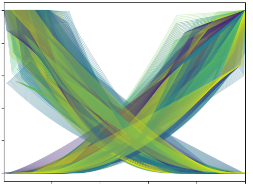

[](https://github.com/equinor/pyscal/actions?query=workflow%3Apyscal)
[](https://lgtm.com/projects/g/equinor/pyscal/context:python)
[](https://lgtm.com/projects/g/equinor/pyscal/alerts/)
[](https://www.python.org)
[](https://black.readthedocs.io/)
[](https://www.gnu.org/licenses/lgpl-3.0)

# pyscal



Python tool module for relative permeability/SCAL support in reservoir simulation

## Documentation

*   <http://equinor.github.io/pyscal>

## Feature overview

*   Command line tool for generating Eclipse input from parameters
    in an XLSX- or CSV-file.

*   API to create relative permeability curves through correlations or
    tables.

*   Consistency checks for three-phase setups, ensures compatibility of
    oil-water tables and gas-oil tables.

*   Support for handling uncertainty, doing book-keeping for low, base
    and high cases, and the possiblity to interpolate between these
    cases using a number from -1 to +1.

## Command line tool
Example use with CSV input for one SATNUM:
```console
$ cat relperminput.csv
SATNUM, swl, sorw, Nw, Now
1,      0.1, 0.05, 2, 3
$ pyscal relperminput.csv --delta_s 0.1 -o relperm.inc
Written to relperm.inc
```

where `relperm.inc` can be used directly as an INCLUDE file in Eclipse or Flow.
The same table as in the CSV above could have been in an XLSX file also.

## Python API usage

Using the Python API, the same curves as above can be constructed with

```python
from pyscal import WaterOil

wo = WaterOil(h=0.1, sorw=0.05, swl=0.1)
wo.add_corey_water(nw=2)
wo.add_corey_oil(now=3)
print(wo.SWOF())
```
which will produce the output
```console
SWOF
--
-- pyscal: 0.4.1
-- swirr=0 swl=0.1 swcr=0.1 sorw=0.05
-- Corey krw, nw=2, krwend=1, krwmax=1
-- Corey krow, now=3, kroend=1
-- krw = krow @ sw=0.46670
-- Zero capillary pressure
-- SW     KRW       KROW      PC
0.1000000 0.0000000 1.0000000 0
0.2000000 0.0138408 0.6869530 0
0.3000000 0.0553633 0.4471809 0
0.4000000 0.1245675 0.2709139 0
0.5000000 0.2214533 0.1483818 0
0.6000000 0.3460208 0.0698148 0
0.7000000 0.4982699 0.0254427 0
0.8000000 0.6782007 0.0054956 0
0.9000000 0.8858131 0.0002035 0
0.9500000 1.0000000 0.0000000 0
1.0000000 1.0000000 0.0000000 0
/
```
